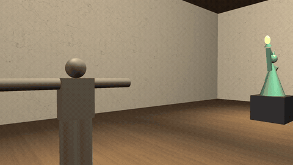

# Museu ambiente simulado - Computação gráfica
Ambiente simulado de um museu feito em OpenGL 2.1 usando C. Onde a câmera percorre o espaço em modo livre (com WASD e mouse), ou um um modo tour automático usando curvas de bézier
Projeto final da matéria de introdução à copmutação gráfica - UFPB

## Demonstração


Modo tour automatico (T):

https://github.com/user-attachments/assets/8ebb57ad-df6e-4977-b4ee-fa430ba52740


## Integrantes do grupo
- Thiago César
- José Roberto
- Vanderley Ferreira

## Sobre o projeto
O programa renderiza uma sala de museu (paredes, piso e teto texturizados) com diferentes itens de exibição, e iluminados por diferentes fontes de luz.

O usuário pode:
- Navegar livremente pelo ambiente em primeira pessoa (modo livre);
- Ativar um tour automático da câmera, que percorre trajetórias suaves definidas por curvas de Bézier cúbicas (modo tour);
- Alternar entre os dois modos a qualquer momento pressionando `T` (o modo livre retoma o controle automaticamente ao usar WASD durante o tour).

Desenvolvido usando C puro, com OpenGL 2.1 e GLUT/freeglut

## Dependências
- `gcc` e GNU Make
- OpenGL 2.1
- `GLUT` ou `freeglut`
- [`stb_image.h`](https://github.com/nothings/stb) — biblioteca *header-only* para carregamento de imagens (usadas nas texturas), de domínio público / licença MIT dupla

No Linux:

```bash
sudo apt install build-essential freeglut3-dev
```

A biblioteca `stb_image.h` já vem internamente no projeto, dentro de `external/`, e não é preciso intalar nada por fora pra carregar as texturas.

## Como compilar e executar

```bash
make
./museu
```
ou somente
```bash
make run
```

O `Makefile` compila usando `gcc`, linkando `-lGL -lGLU -lglut -lm` do OpenGL e incluindo os diretórios `-Iexternal -Isrc`.

## Controles

| Tecla / ação | Efeito |
|---|---|
| `W A S D` | Movimento em modo livre |
| Mouse | Olhar ao redor (modo livre) |
| `T` | Alterna entre modo livre e modo tour |
| `W A S D` durante o tour | Retoma o controle manual da câmera |

## Principais problemas encontrados

- Na movimentação da câmera no começo teve um pequeno bug de que a câmera voava quando olhava para cima, pois não tinhamos travado a movimentação no plano vertical.
- Quando foi implementado a normalização de vetores no modo livre da câmera, foi preciso um guarda contra divisão por zero, pois enquanto movimenta a camera o vetor direção chega a um valor módulo muito próximo de 0.
- Por conta de `stb_image.h` ser uma biblioteca header-only, foi preciso definir `STB_IMAGE_IMPLEMENTATION` somente em um arquivo `.c`. Pois quando definido em mais de um acontece erro de linkagem

## O que pode ser melhorado

- Adicionar fontes de luz dinâmicas e exibições dinâmicas, que se movem pela cena
- Adicionar uma detecção de colisão mais completa e robusta, pois no momento a colisão é apenas com os limites da sala
- Expandir a variedade de itens de exibição e as texturas


## Os elementos das atividades práticas
| Atividade prática | Onde está implementado | Descrição |
|---|---|---|
| Primitivas e cor |  |  |
| Visualização 3D / hierarquia | `exibicoes.c` (`exponatos_desenhar`) | Itens de exibição montados com transformações hierárquicas (pilha de matrizes) |
| Visibilidade / z-buffer | `main.c` (`GL_DEPTH_TEST`) | Teste de profundidade garante oclusão correta entre os objetos da cena |
| Iluminação | `iluminacao.c` | `GL_LIGHT0` configurada em `iluminacao_iniciar()`; posição atualizada a cada frame em `iluminacao_atualizar()` (depende da modelview, por isso é chamada após `camera_aplicar_visualizacao()`); materiais por objeto via `glMaterialfv` em `exibicoes.c` |
| Texturas | `texture.c` | Wrapper sobre a `stb_image.h`; usada para aplicar texturas de piso/parede em `cena.c` |
| Curvas paramétricas | `curvas.c` (`curva_avaliar`) | Curva de Bézier cúbica avaliada em `t ∈ [0,1]`, usada em `camera.c` (`atualizar_modo_tour`) pro deslocamento automático da câmera |


## O que cada integrante fez
